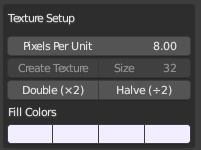
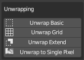
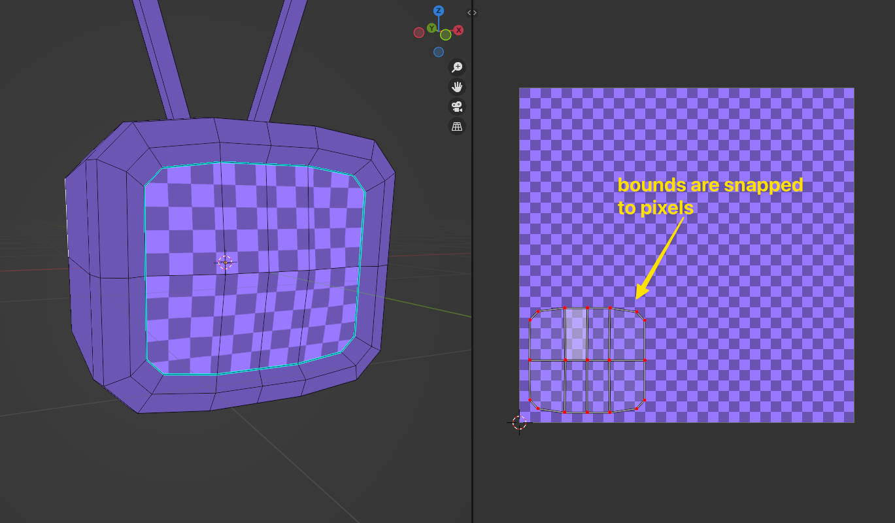
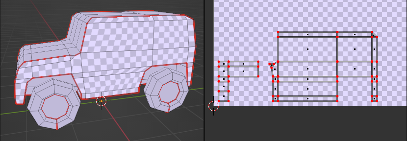
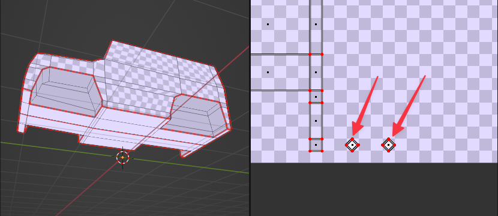
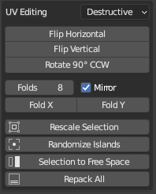
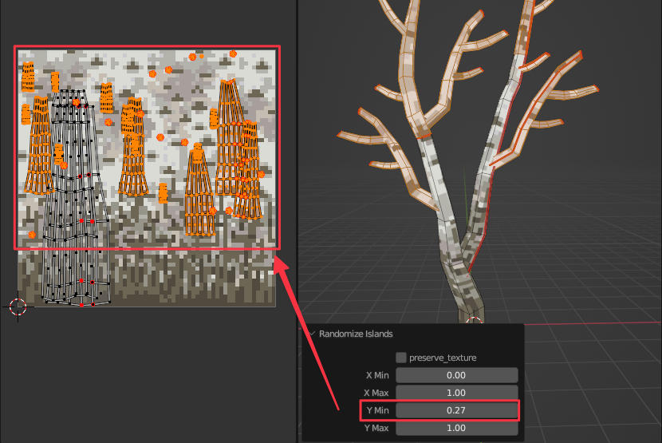

>   __WARNING: EARLY ALPHA VERSION.__  
    __CAN CRASH BLENDER.__  
    __USE AT YOUR OWN RISK AND SAVE REGULARLY__  

# Pixel Perfect Unwrapping for Blender

[Overview Image: good pixel mapping vs bad]

This is an add-on for Blender that helps creating **Pixel Art 3D** or **lo-fi 3D**. This style looks best when:

1. Pixels align with edges on models
2. Pixels are roughly the same size across the model

Blender's standard unwrapping tools can make this tedious. I wrote this add-on to make that easier.

# Installation

Go to [Releases](https://github.com/noio/Pixel-Unwrapper/releases/latest) and download the **Source code (zip)**. Then go to Blender Preferences, `Add-ons`, click `Install...` and select the .zip file.

# Features

## Pixels Per Unit

To make it easy to stick to a consistent pixel size across the model, you set your desired **Pixel Density** here. The [Unwrapping](#unwrapping) operators, as well as the [Rescale Selection](#rescale-selection) operator, use this to determine the UV scale.

Because most operators take into account Pixel Density and texture size, they will only work **if the active object has a texture**.

## Create Texture

If your model does not have a material with a texture yet, use this button to create them. It will also set the *Texture Interpolation* to *Closest*.

## Unwrapping

### Unwrap Basic

Performs a standard Blender Unwrap operation, but scales the result to match the Pixel Density. Then, it will scale and move the selection so that **the bounds align with pixel edges on the texture**. Internal vertices are not snapped to pixels

### Unwrap Grid

This is the tool I use most. It detects a **grid of quads** in the selection, and maps each **row and column** of that grid to the closest multiple of whole pixels (applying the Pixel Density). Any attached non-quads are unwrapped using Blender's standard unwrap. If the quads in your model are very deformed, the pixels will be distorted too. Before I wrote this plugin, I used the **Snap to Axis** operator from [UVSquares](https://www.blendermarket.com/products/uv-squares) and then scaled things manually to match the Pixel Density.

### Unwrap Extend

Not super useful. Just unwraps unpinned faces. Basically identical to standard blender Unwrap.

### Unwrap to Single Pixel

Sometimes you have a bunch of faces that you just want to fill with a color. This operator maps those to a single pixel on the texture. Each time you apply the operator, the selection is mapped to a free bit of texture so you can fill it with a different color.

## UV Editing

When doing 3D Pixel Art, it's not always clear from the beginning which details need geometry and which can be desiged as (transparent) textures. Being able to start painting a bit of texture and then go back to modelling is very helpful. To aid with that, some UV operators can be applied **while preserving the bits of texture you have already painted**.

 - **Destructive** mode is the normal mode of UV editing. If you have already created a texture, it will become jumbled on the model as UV faces move. 
 - **Preserve Texture** will attempt to **move pixels on the texture** as the operator is applied, to preserve how the texture fits on the model. Not all operators are compatible with this mode. 

### Flip

Will flip the selected faces on the UV map. It uses pixel-snapped UV bounds for the flipping, even if the vertices are not snapped to pixels.

### Rotate

Rotates the selected faces 90 degrees CCW on the UV map. In **Preserve Texture** mode, the island is **moved to a free bit of UV space**, so that the original texture can be copied there without overwriting any other islands.

### Folding

### Rescale Selection

Rescales the selection to match the Pixel Density.

### Selection to Free Space

Moves the selection to a free bit of UV space. In **Preserve Texture** mode, it copies the texture pixels to the new UV location. 

The plugin assumes that **texture size is not an issue**. Pixel art textures are so small that efficient texture space usage is not a priority. By letting the plugin loosely pack UV islands onto the texture, the workflow is made a lot more flexible. It allows you to start texture painting before finalizing the UV mapping of a model, as there's always some extra space to paint newly added geometry later. If you're creating assets for a game and are worried about GPU memory, it's best to use a packing tool as a final step in the art pipeline. I recommend [SpriteUV](https://www.spriteuv.com).

### Randomize Islands

Moves each island to a random position on the UV map. This can be useful for assigning random sections of a uniform texture (tree bark, ground dirt, etc).

### Repack All

Repacks all islands onto the bottom of the UV map. This is useful for freeing up some texture space for other operators that need it. Note that islands will be rotated to make for a tighter fit, **unless** they were rotated manually using the [Rotate](#rotate) operator.

## Caveats

 - Not all operators can deal with a single texture that is used on multiple objects. For example, [Repack](#repack-all) will not take into account faces of other objects when packing.
 - The plugin does not distinguish between multiple materials used on the same objects. It treats all faces as if they're using the same texture when deciding what is 'free UV space'.